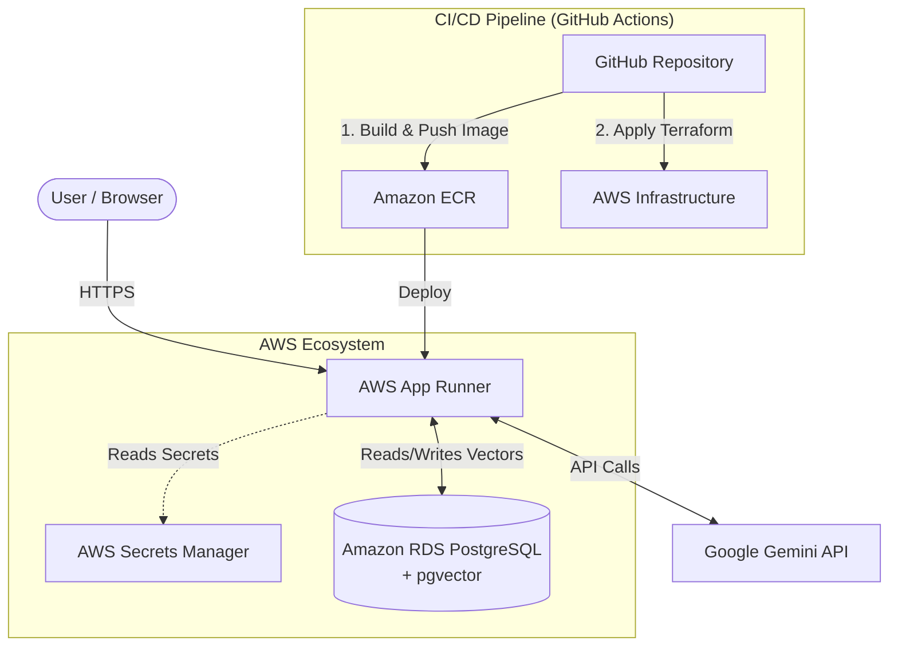

# Agentic Data Analyzer - Low-Cost serverless LLM Data Processing Pipeline

This project provides an **AI Agentic Framework** that automates complex data analysis tasks (ingestion, sanitization, Vector search sync, trend discovery, forecasting, and narrative synthesis) using Google Gemini and serverless infrastructure.

## 🛠️ System Architecture

The infrastructure is optimized to provide high durability, extreme scalability, and **lowest possible cost** (under $15/month for low-usage development environments):

1. **Compute (AWS App Runner)**: Implements the Node.js/Express API and React client in a single container. Since AWS App Runner supports auto-scaling to zero or lowest memory settings when idle, platform costs are highly optimized.
2. **Database (Amazon RDS PostgreSQL + PGVECTOR)**: Serves as both your relational configuration store and your **Scalable Vector Database** using Postgres' native `pgvector` extension. Using a single database for both roles saves hundreds of dollars compared to independent vector products (Pinecone, Weaviate setups). Setting the instance class to a small burstable `db.t4g.micro` keeps the database running for around **$11.50/month**.
3. **LLM Engine (Google Gemini)**: Driven via the Node `@google/genai` TypeScript SDK server-side on App Runner, securing keys via AWS Secrets Manager.

### System Diagram



---

## 🎮 How to Use the Application

Once running locally or deployed, open the application in your browser to interact with the Agentic Data Processing Pipeline:

1. **Workspace Explorer**: The default view shows the repository files. Read the `README.md`, examine the `deploy.yml`, or look at the CI/CD code snippets.
2. **Analysis Pipeline (Action Center)**: Click the "Analysis Pipeline" tab to view the live processing interface.
3. **Select a Data Template**: Choose either "SaaS Subscription Metrics" or "E-Commerce User Retention Data" as sample data to process.
4. **Execute Pipeline**: Click **Execute Agentic Pipeline**. The system will:
   - Run data validation and basic sanitization.
   - Sync the semantic text chunks with the vector database.
   - Call the Google Gemini API to analyze the data chunks.
   - Output structured actionable insights (trends, anomalies, recommendations).
5. **View Results**: The generated insights and correlations will be displayed in the UI, and a visualized chart will be rendered dynamically using the returned metrics.

---

## 📊 Monitoring AWS Once Deployed

Once you have deployed the application to AWS using Terraform or GitHub Actions, you can monitor the application and track its behavior natively inside the AWS Management Console:

### 1. AWS App Runner Console (Compute & Logs)
- Navigate to **App Runner** in the AWS Console.
- Select your service (`agentic-data-analyzer`).
- **Logs**: Click the **Logs** tab to see real-time output from your Node.js Express server. This is where you will see the vector embeddings syncing and Gemini API calls occurring.
- **Metrics**: View the CPU usage, memory utilization, and active request count under the **Metrics** tab.

### 2. Amazon RDS (Database Insights)
- Navigate to **RDS** -> **Databases**.
- Select the `agent-pg-db` instance to see active connections and CPU loads.
- If you connect to your database using a client like pgAdmin or DBeaver, you can run queries on the `document_embeddings` table to inspect the exact high-dimensional vectors stored by the LLM.

### 3. AWS CloudWatch (Alarms & Dashboards)
- All the App Runner logs and RDS metrics are automatically forwarded to **CloudWatch**.
- Navigate to **CloudWatch** -> **Log groups** to query historical logs or set up error alerting.

---

## 📁 Directory Structure

- `/server.ts`: The full-stack Express Server powering the custom agentic processing pipeline.
- `/src/`: React visual companion companion console, containing interactive charts, drag-and-drop file ingestion, pipeline editor, and config explorers.
- `/terraform/`: Infrastructure-as-code files:
  - `main.tf`: Declares VPC networks, firewall parameters, serverless access connectors, postgres vector databases, and container host policies.
  - `providers.tf`, `variables.tf`, `outputs.tf`: Full terraform config structures.
- `/.github/workflows/deploy.yml`: Production CI/CD workflow pushing code to Amazon ECR and executing `terraform apply` seamlessly on commit.

---

## 🚀 Local Quickstart

### 1. Configure Secrets
Ensure you have your Gemini API secret key. Copy `.env.example` to `.env` :
```bash
cp .env.example .env
```
Specify your `GEMINI_API_KEY` inside `.env`.

### 2. Live Dev Server
Run the development environment locally (port 3000):
```bash
npm install
npm run dev
```
Open your browser at `http://localhost:3000`.

---

## ☁️ Cloud Provisioning via Terraform

To spin up this entire low-cost ecosystem in your AWS Account:

```bash
cd terraform

# Initialize terraform plugins
terraform init

# Review the planned list of resources
terraform plan \
  -var="aws_region=YOUR_AWS_REGION" \
  -var="db_password=YOUR_SECURE_PASSWORD" \
  -var="gemini_api_key=YOUR_GEMINI_KEY"

# Provision infrastructure on AWS
terraform apply \
  -var="aws_region=YOUR_AWS_REGION" \
  -var="db_password=YOUR_SECURE_PASSWORD" \
  -var="gemini_api_key=YOUR_GEMINI_KEY"\
  -auto-approve
```

---

## 🔄 CI/CD Git Deployment
To deploy automatically on every code push:
1. Configure your GitHub repository.
2. Set up GitHub Secrets:
   - `AWS_ACCESS_KEY_ID`: Your target AWS access key ID.
   - `AWS_SECRET_ACCESS_KEY`: Your target AWS secret access key.
   - `AWS_DEFAULT_REGION`: Your target AWS region.
   - `AWS_DB_PASSWORD`: A secure text password of your choosing that will be used to initialize the Postgres vector instance admin account.
   - `GEMINI_API_KEY`: Your Gemini credentials used server-side.
3. Push to `main` branch to trigger the action.
